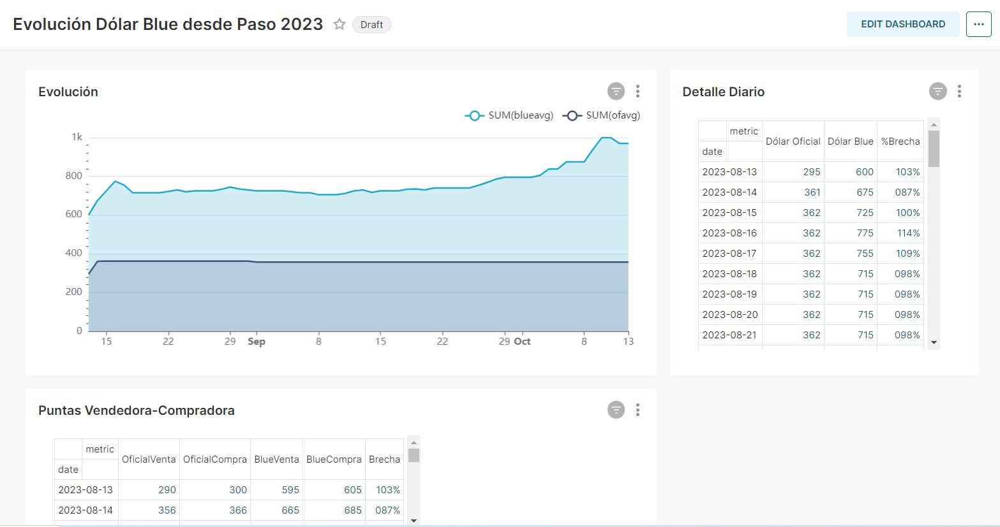

# Entrega Final Taller De Tópicos Intensivos.- ECD- ITBA [🇪🇸]
## Fernando MESERI
Este repositorio permite  disponibilizar las cotizaciones del dólar  Oficial  y paralelo-- Blue -- para ARGENTINA desde las elecciones primarias - PASO -  del 13 de Agosto de 2023.
Se obtiene la informacion de la API de BLueANalytics
#### https://api.bluelytics.com.ar/v2/historical?day=2023-08-13
Es importante comentar que es posible utilizar el código para tomar la cotización desde una fecha anterior o posterior.
Esta fecha puede editarse en el DAG -->./airflow/dags/Dolar_Historico_dag.py  modificando el  
'start_date': datetime(2023, 8, 13)

Se deja disponible la data, así como su análisis y gráficos asociados en Superset.

Una vez levantado el ambiente se debe ingresar a airflow desde http://localhost:9090, luego encender el DAG correspondiente.

## Contenidos
* [Levantar el ambiente](#levantar-ambiente)
* [Ingresar a Superset](#levantar-ambiente)

## Infrastructura
El repositorio simula una instalación de producción utilizando container de Docker.
[docker-compose.yml](docker-compose.yml) contiene las definiciones y configuraciones para esos servicios y sus respectivas UIs.

